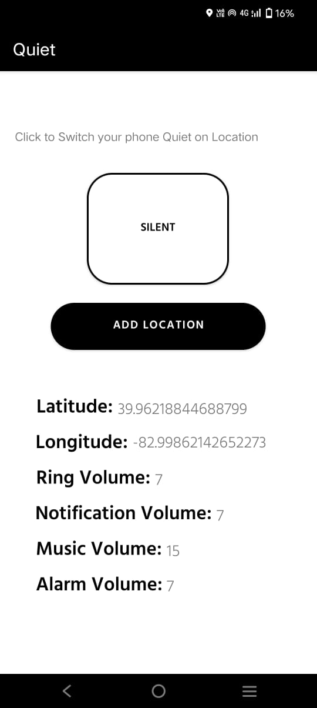
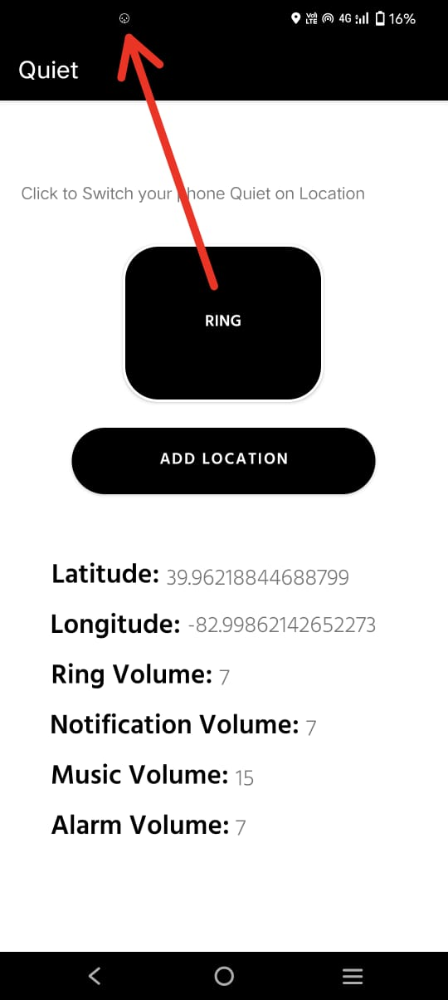
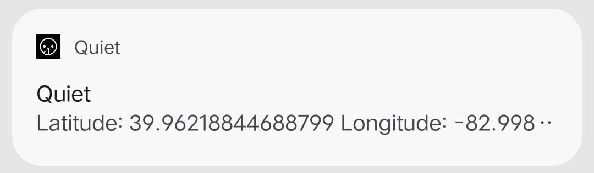
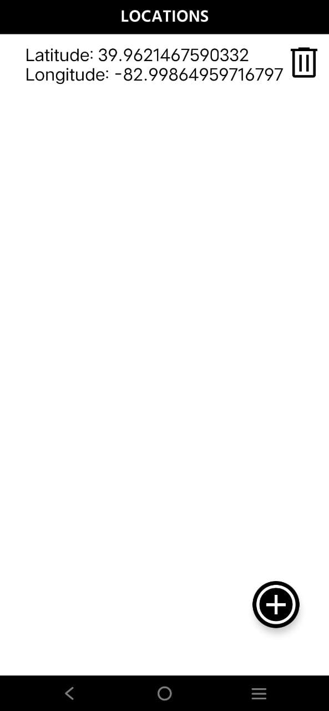
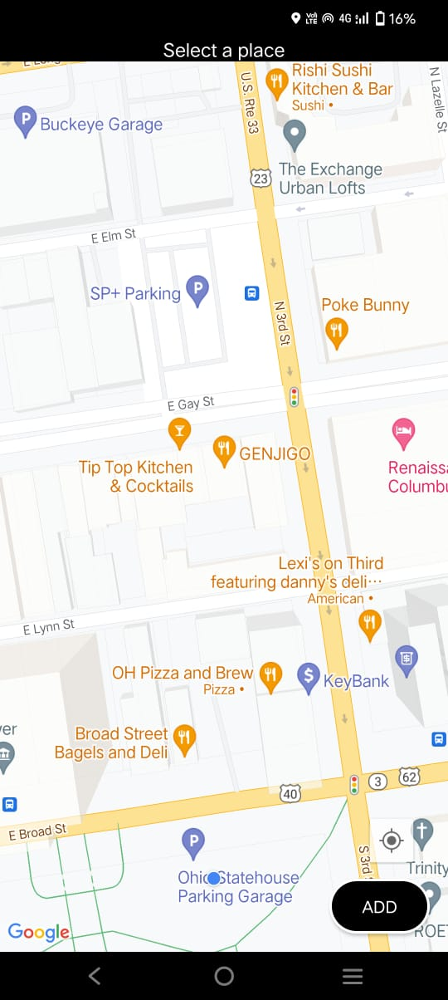

# Quiet_Android_App

I have created a simple app, that use user's current location to change volume of the device. 
It works above android 10.
It has a foreground service, which checks if the user is within the 50m radius.'
Its my first project, so there are lot of problems with the app.
Problems:
1. it sometimes does not change the volume of music stream.
2. the foreground service stops if the battery is below 15.
3. needs user to give app, unlimited battery usage.
it works fine other than that.

